# Memory Graph Exercises

| Exercise | Stars | Image | Code | Solution |
|----------|-------|-------|------|----------|
| 1  | \*\*      |<a href="exercise1.png">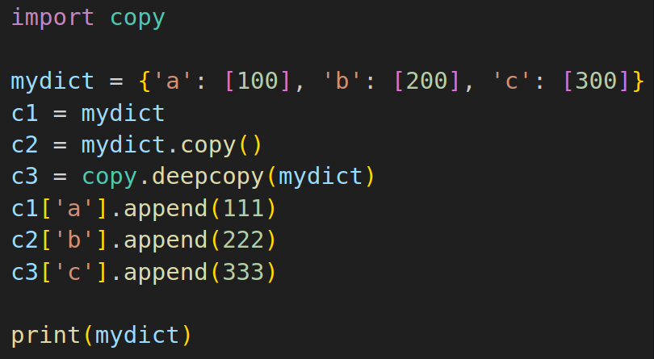</a> | [exercise1.py](exercise1.py) | [solution1](https://memory-graph.com/#codeurl=https://raw.githubusercontent.com/bterwijn/memory_graph_videos/refs/heads/main/exercises/exercise1.py&play) |
| 2  | \*\*      |<a href="exercise2.png">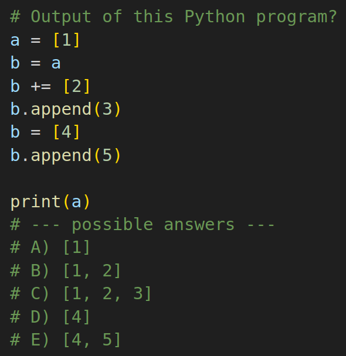</a> | [exercise2.py](exercise2.py) | [solution2](https://memory-graph.com/#codeurl=https://raw.githubusercontent.com/bterwijn/memory_graph_videos/refs/heads/main/exercises/exercise2.py&play) |
| 3  | \*        |<a href="exercise3.png">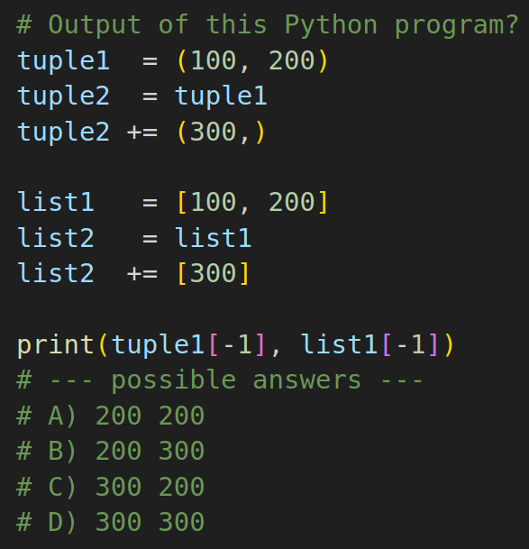</a> | [exercise3.py](exercise3.py) | [solution3](https://memory-graph.com/#codeurl=https://raw.githubusercontent.com/bterwijn/memory_graph_videos/refs/heads/main/exercises/exercise3.py&play) |
| 4  | \*        |<a href="exercise4.png">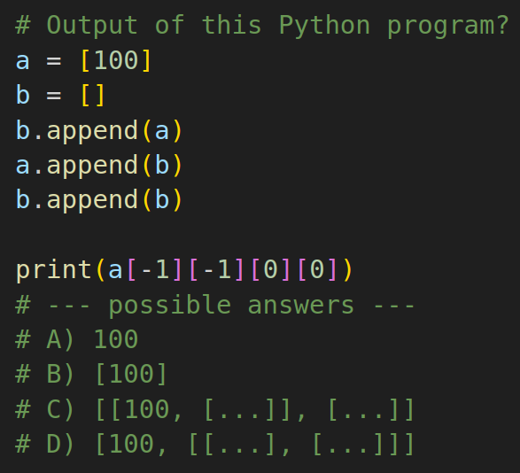</a> | [exercise4.py](exercise4.py) | [solution4](https://memory-graph.com/#codeurl=https://raw.githubusercontent.com/bterwijn/memory_graph_videos/refs/heads/main/exercises/exercise4_mg.py&play) |
| 5  | \*\*\*    |<a href="exercise5.png">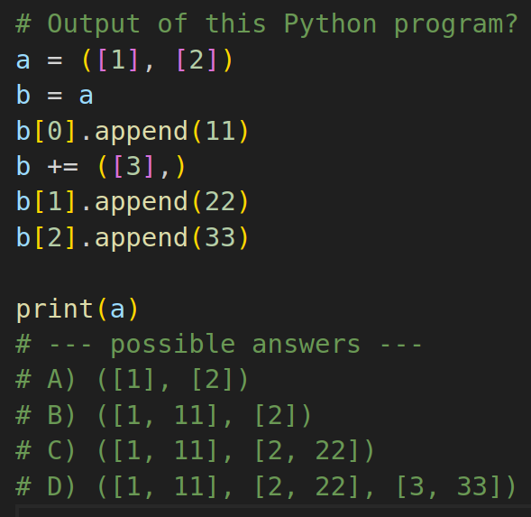</a> | [exercise5.py](exercise5.py) | [solution5](https://memory-graph.com/#codeurl=https://raw.githubusercontent.com/bterwijn/memory_graph_videos/refs/heads/main/exercises/exercise5.py&play) |
| 6  | \*        |<a href="exercise6.png">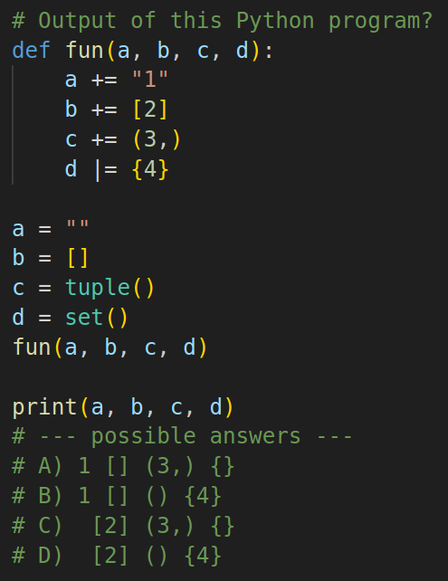</a> | [exercise6.py](exercise6.py) | [solution6](https://memory-graph.com/#codeurl=https://raw.githubusercontent.com/bterwijn/memory_graph_videos/refs/heads/main/exercises/exercise6_mg.py&play) |
| 7  | \*\*      |<a href="exercise7.png">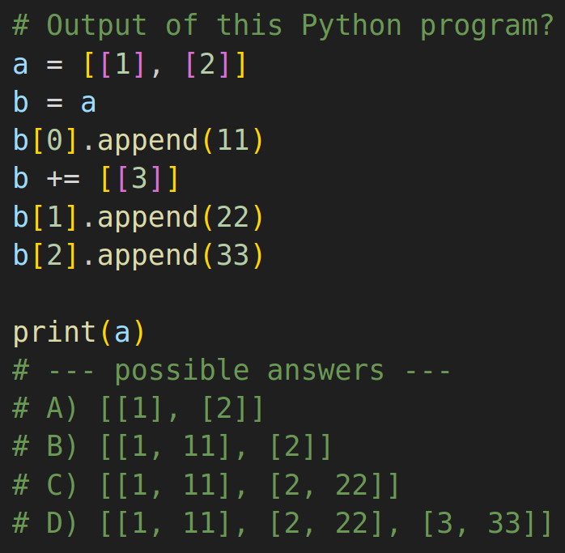</a> | [exercise7.py](exercise7.py) | [solution7](https://memory-graph.com/#codeurl=https://raw.githubusercontent.com/bterwijn/memory_graph_videos/refs/heads/main/exercises/exercise7.py&play) |
| 8  | \*\*      |<a href="exercise8.png">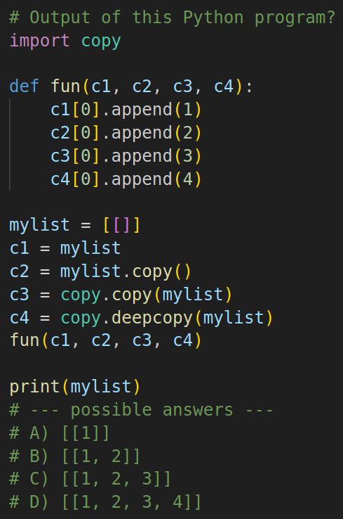</a> | [exercise8.py](exercise8.py) | [solution8](https://memory-graph.com/#codeurl=https://raw.githubusercontent.com/bterwijn/memory_graph_videos/refs/heads/main/exercises/exercise8.py&play) |
| 9  | \*\*\*    |<a href="exercise9.png">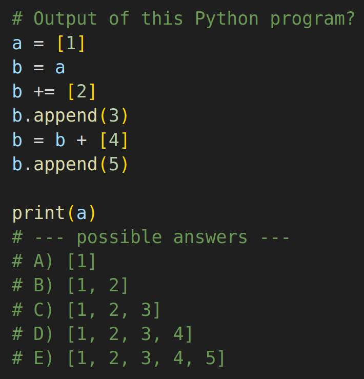</a> | [exercise9.py](exercise9.py) | [solution9](https://memory-graph.com/#codeurl=https://raw.githubusercontent.com/bterwijn/memory_graph_videos/refs/heads/main/exercises/exercise9.py&play) |
| 10 | \*\*      |<a href="exercise10.png">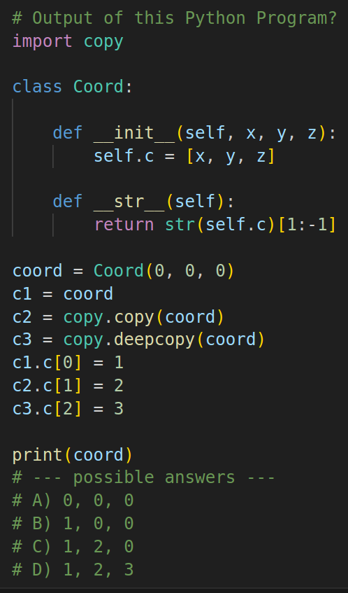</a> | [exercise10.py](exercise10.py) | [solution10](https://memory-graph.com/#codeurl=https://raw.githubusercontent.com/bterwijn/memory_graph_videos/refs/heads/main/exercises/exercise10.py&play) |
| 11 | \*\*      |<a href="exercise11.png">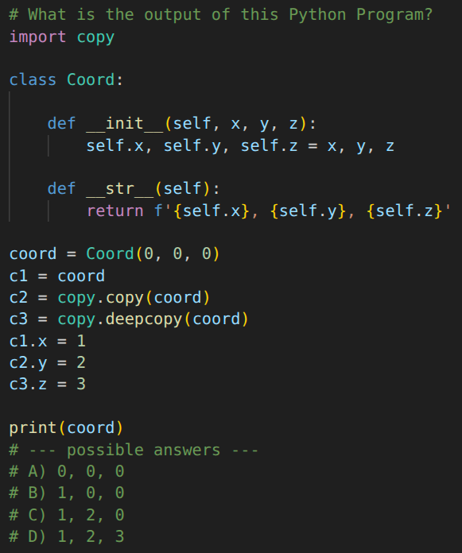</a> | [exercise11.py](exercise11.py) | [solution11](https://memory-graph.com/#codeurl=https://raw.githubusercontent.com/bterwijn/memory_graph_videos/refs/heads/main/exercises/exercise11.py&play) |
| 12 | \*        |<a href="exercise12.png">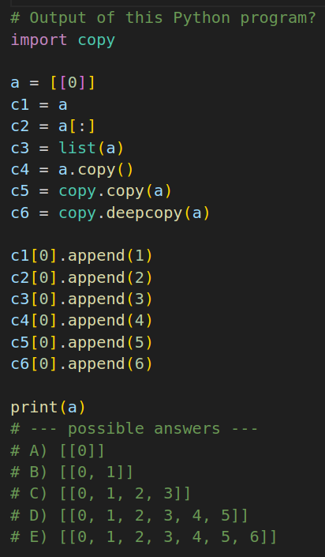</a> | [exercise12.py](exercise12.py) | [solution12](https://memory-graph.com/#codeurl=https://raw.githubusercontent.com/bterwijn/memory_graph_videos/refs/heads/main/exercises/exercise12.py&play) |
| 13 | \*        |<a href="exercise13.png">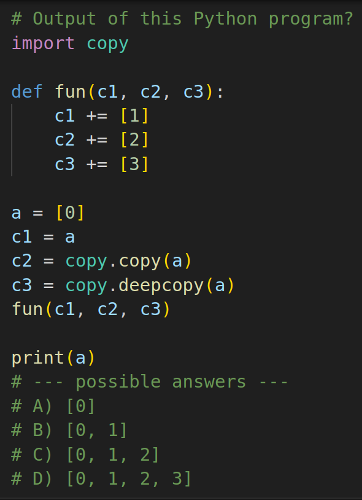</a> | [exercise13.py](exercise13.py) | [solution13](https://memory-graph.com/#codeurl=https://raw.githubusercontent.com/bterwijn/memory_graph_videos/refs/heads/main/exercises/exercise13.py&play) |
| 14 | \*\*      |<a href="exercise14.png">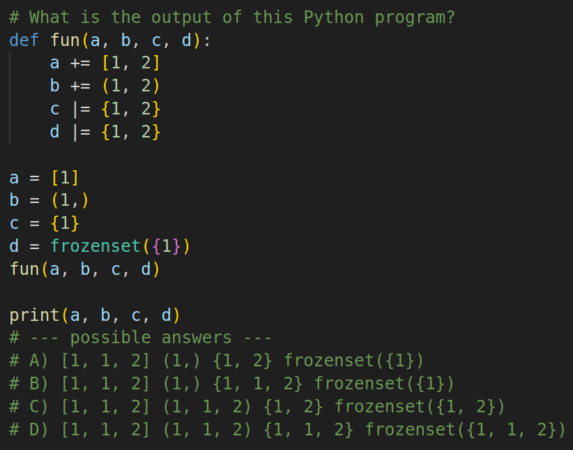</a> | [exercise14.py](exercise14.py) | [solution14](https://memory-graph.com/#codeurl=https://raw.githubusercontent.com/bterwijn/memory_graph_videos/refs/heads/main/exercises/exercise14.py&play) |
| 15 | \*\*\*\*  |<a href="exercise15.png">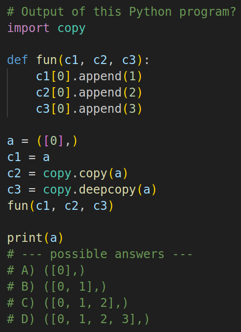</a> | [exercise15.py](exercise15.py) | [solution15](https://memory-graph.com/#codeurl=https://raw.githubusercontent.com/bterwijn/memory_graph_videos/refs/heads/main/exercises/exercise15.py&play) |
| 16 | \*\*\*\*  |<a href="exercise16.png">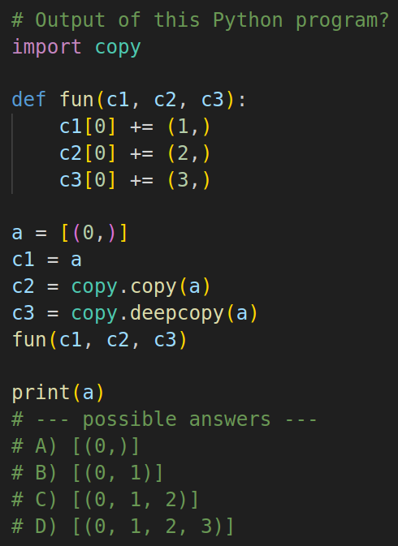</a> | [exercise16.py](exercise16.py) | [solution16](https://memory-graph.com/#codeurl=https://raw.githubusercontent.com/bterwijn/memory_graph_videos/refs/heads/main/exercises/exercise16.py&play) |
| 17 | \*\*      |<a href="exercise17.png">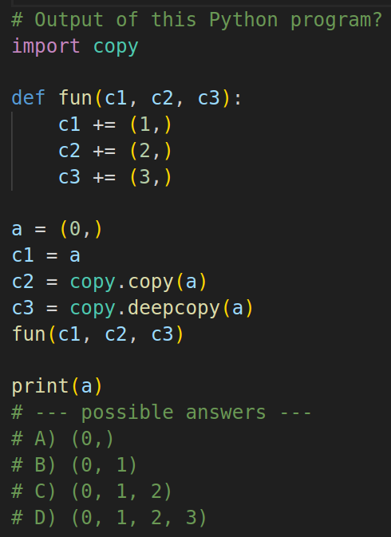</a> | [exercise17.py](exercise17.py) | [solution17](https://memory-graph.com/#codeurl=https://raw.githubusercontent.com/bterwijn/memory_graph_videos/refs/heads/main/exercises/exercise17.py&play) |
| 18 | \*        |<a href="exercise18.png">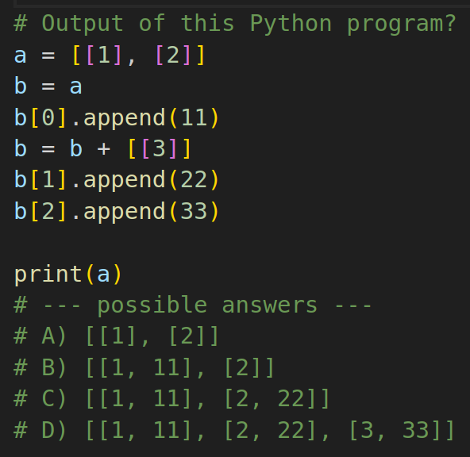</a> | [exercise18.py](exercise18.py) | [solution18](https://memory-graph.com/#codeurl=https://raw.githubusercontent.com/bterwijn/memory_graph_videos/refs/heads/main/exercises/exercise18.py&play) |