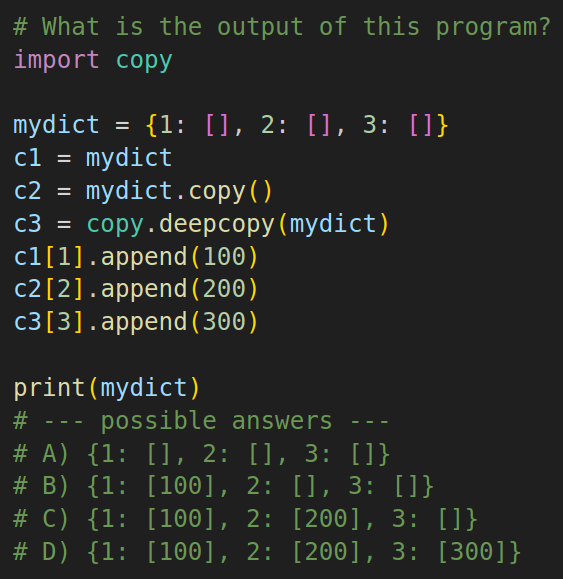
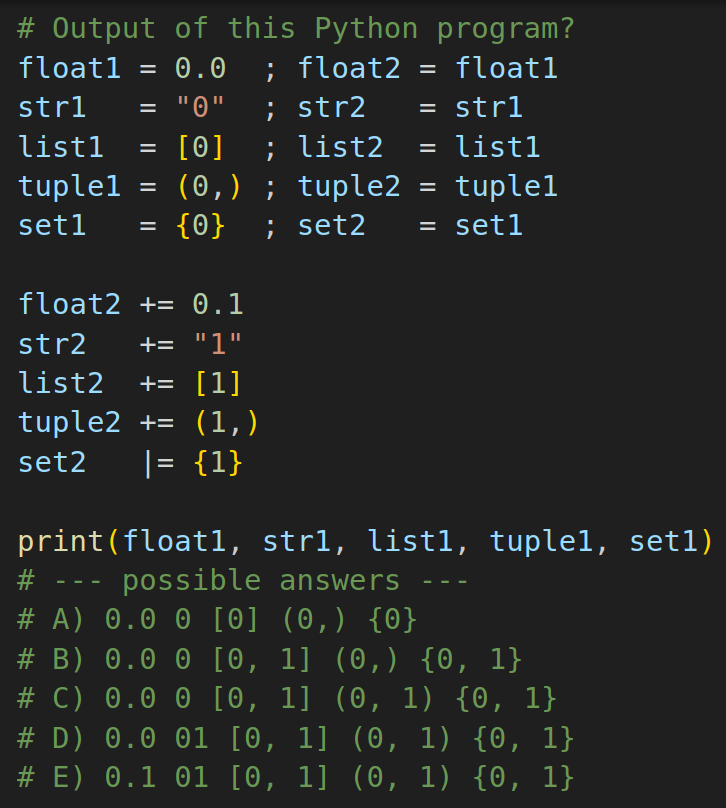
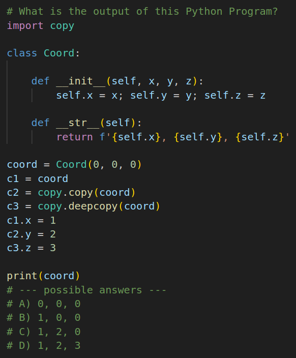

# Memory Graph Exercises

| Exercise | Difficulty | Image | Code | Solution |
|----------|------------|-------|------|----------|
| 1  | \*\*      | | [exercise1.py](exercise1.py) | [exercise1.gif](exercise1.gif) |
| 2  | \*\*      | | [exercise2.py](exercise2.py) | [exercise2.gif](exercise2.gif) |
| 3  | \*        | | [exercise3.py](exercise3.py) | [exercise3.gif](exercise3.gif) |
| 4  | \*\*\*    | | [exercise4.py](exercise4.py) | [exercise4.gif](exercise4.gif) |
| 5  | \*        | | [exercise5.py](exercise5.py) | [exercise5.gif](exercise5.gif) |
| 6  | \*        | | [exercise6.py](exercise6.py) | [exercise6.gif](exercise6.gif) |
| 7  | \*\*      | | [exercise7.py](exercise7.py) | [exercise7.gif](exercise7.gif) |
| 8  | \*\*      | | [exercise8.py](exercise8.py) | [exercise8.gif](exercise8.gif) |
| 9  | \*\*      | | [exercise9.py](exercise9.py) | [exercise9.gif](exercise9.gif) |
| 10 | \*\*      | | [exercise10.py](exercise10.py) | [exercise10.gif](exercise10.gif) |
| 11 | \*\*      | | [exercise11.py](exercise11.py) | [exercise11.gif](exercise11.gif) |
| 12 | \*        | | [exercise12.py](exercise12.py) | [exercise12.gif](exercise12.gif) |
| 13 | \*        | | [exercise13.py](exercise13.py) | [exercise13.gif](exercise13.gif) |
| 14 | \*\*      | | [exercise14.py](exercise14.py) | [exercise14.gif](exercise14.gif) |
| 15 | \*\*\*\*  | | [exercise15.py](exercise15.py) | [exercise15.gif](exercise15.gif) |
